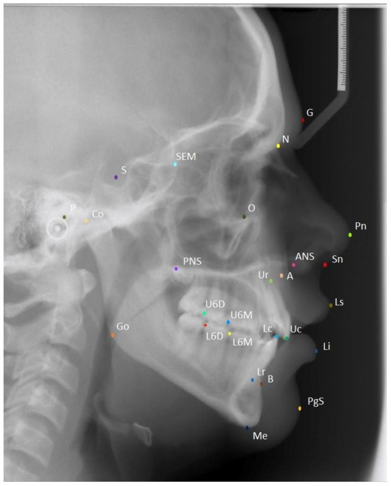
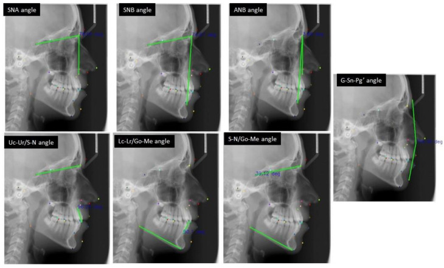
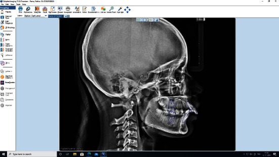
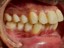
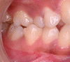
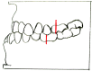

# 歯科矯正の診断 ― 全体の流れ

> このファイルは歯科矯正の初学者向けに、11歳でも理解できるレベルで書かれています。
> 専門用語には（ ）で意味を添えています。

---

## はじめに：矯正の診断って何をするの？

矯正の診断とは、ざっくり言うと：

**「患者さんの顔と歯とアゴを調べて、どこがズレてるか見つけて、どう治すか決める」** こと。

お医者さんが風邪の診断をするときに「のどを見て、熱を測って、何の病気か決める」のと同じです。
矯正では「レントゲンを撮って、模型を作って、どこがズレてるか決める」のです。

---

## 全体の流れ（5ステップ）

| ステップ | やること | かんたんに言うと |
|---|---|---|
| **1. 資料採得**（しりょうさいとく） | 写真・レントゲン・模型を取る | 「情報をたくさん集める」 |
| **2. セファロ分析**（せふぁろぶんせき） | 頭のレントゲンに点を打って線を引く | 「アゴと頭の位置関係を数字で測る」 |
| **3. 模型分析**（もけいぶんせき） | 歯の模型を測る | 「歯の大きさやアーチの形を調べる」 |
| **4. 診断**（しんだん） | 集めた情報から問題を特定する | 「何がズレてるか決める」 |
| **5. 治療計画**（ちりょうけいかく） | どう治すか決める | 「作戦を立てる」 |

---

## ステップ1：資料採得（しりょうさいとく）

> 「資料採得」＝ 診断に必要な情報を集めること

診断のために集める資料は主に **5つ** です：

### 1. パノラマX線写真（パノラマ）
- 歯全体が1枚で見えるレントゲン
- 歯の数・根っこの状態・骨の様子がわかる

### 2. セファログラム（セファロ）＝ 頭部X線規格写真
- 横顔の頭のレントゲン
- **矯正で一番大事なレントゲン！**
- 頭・アゴ・歯の位置関係を数字で測れる
- どこの病院で撮っても同じ規格（ルール）で撮影するので比較できる

### 3. 口腔内写真（こうくうないしゃしん）
- お口の中の写真
- 正面・左右・上あごから見た写真・下あごから見た写真の5枚が基本

### 4. 顔貌写真（がんぼうしゃしん）
- 顔の写真
- 正面・横顔（左右）の3枚が基本
- 顔の左右のバランスや横顔のラインを見る

### 5. 歯列模型（しれつもけい）
- 歯型を取って作る石膏（せっこう）の模型
- 歯の大きさ・並び方・噛み合わせを実物大で見られる

---

## ステップ2：セファロ分析（矯正診断のキモ！）

> セファロ分析とは：頭部X線規格写真（横顔のレントゲン）に **点（ポイント）** を打って、
> **線（平面）** を引いて、**角度や距離** を測ること。

### セファロのレントゲン写真と計測点

下の画像は、実際のセファログラム（横顔のレントゲン）に26個の計測点を打ったものです。

*出典: PMC9687964 "Learning Cephalometric Landmarks" (CC BY 4.0)*

---

### まず覚える計測点（ポイント）8つ

レントゲンの上に打つ「目印」のことを **計測点（けいそくてん）** と言います。
英語では **Landmark（ランドマーク）** と言います。

| 記号 | 名前 | 場所（かんたんに） |
|---|---|---|
| **S** | セラ（Sella） | 頭の中にあるくぼみ（トルコ鞍＝とるこあん）の真ん中 |
| **N** | ナジオン（Nasion） | おでこと鼻の骨がつながるところ |
| **Or** | オルビターレ（Orbitale） | 目の穴（眼窩＝がんか）の一番下 |
| **Po** | ポリオン（Porion） | 耳の穴の一番上 |
| **A** | A点（A-point） | 上あごの歯ぐきの骨の一番へこんだところ |
| **B** | B点（B-point） | 下あごの歯ぐきの骨の一番へこんだところ |
| **Pog** | ポゴニオン（Pogonion） | あご先の一番前に出てるところ |
| **Me** | メントン（Menton） | あご先の一番下 |

#### 補足：追加で知っておきたい計測点

| 記号 | 名前 | 場所（かんたんに） |
|---|---|---|
| **ANS** | 前鼻棘（ぜんびきょく、Anterior Nasal Spine） | 上あごの前の方にあるとがった骨 |
| **PNS** | 後鼻棘（こうびきょく、Posterior Nasal Spine） | 上あごの後ろの方にあるとがった骨 |
| **Go** | ゴニオン（Gonion） | 下あごの角（えら）のところ |
| **Gn** | グナシオン（Gnathion） | あご先の一番下かつ一番前のところ |
| **Co** | コンディリオン（Condylion） | 下あごの関節の一番上 |

---

### 基準になる線（平面）3つ

計測点を結んで **基準の線** を作ります。
この線を使って「どこがどれだけズレてるか」を測ります。

| 名前 | 結ぶ点 | 意味 |
|---|---|---|
| **SN平面** | S と N を結ぶ | 頭の底（頭蓋底＝とうがいてい）の基準線 |
| **FH平面**（フランクフルト平面） | Or と Po を結ぶ | 顔の水平の基準線 |
| **下顎下縁平面**（かがくかえんへいめん） | Me を通って下あごの下を通る線 | 下あごの角度を見る線 |

---

### 超重要な角度3つ（SNA・SNB・ANB）

*出典: PMC9687964 "Learning Cephalometric Landmarks" (CC BY 4.0)*

上の画像を見てください。SNA角、SNB角、ANB角がどのように測定されるかが分かります。

| 角度 | 何を見る？ | 正常値 | かんたんに言うと |
|---|---|---|---|
| **SNA** | 上あごの前後位置 | 約82° | 「上あごは前に出すぎ？引っ込みすぎ？」 |
| **SNB** | 下あごの前後位置 | 約80° | 「下あごは前に出すぎ？引っ込みすぎ？」 |
| **ANB** | 上と下あごのズレ | 約2°（±2°） | 「上あごと下あごのバランスは？」 |

#### ANBの読み方（超大事！）

ANB角は「上あご（A点）と下あご（B点）の前後のズレ」を表します。

- ANBが **4°以上** → 上あごが前に出てる or 下あごが引っ込んでる → **上顎前突**（じょうがくぜんとつ）傾向
- ANBが **0～4°** → 正常範囲
- ANBが **0°以下**（マイナス） → 下あごが前に出てる → **下顎前突**（かがくぜんとつ）傾向

---

### その他の重要な角度

| 角度 | 何を見る？ | 正常値 |
|---|---|---|
| **FMA**（FH-MP角） | 下あごの開き具合 | 約25° |
| **U1 to SN** | 上の前歯の傾き | 約104° |
| **IMPA**（L1 to MP） | 下の前歯の傾き | 約90° |
| **Interincisal angle** | 上下の前歯の間の角度 | 約130° |

- FMAが大きい（30°以上）→ **開咬**（かいこう＝前歯が噛めない）傾向
- FMAが小さい（20°以下）→ **過蓋咬合**（かがいこうごう＝噛み合わせが深い）傾向

---

### セファロトレーシング（セファロのなぞり書き）

*出典: PMC9225851 "Cephalometric Analysis Using AI" (CC BY)*

セファロ分析では、レントゲンの上にトレーシングペーパーを置いて（または
コンピュータで）骨の輪郭をなぞり、計測点を打ち、線を引いて角度を測ります。

---

## ステップ3：不正咬合の分類（Angleの分類）

> 不正咬合（ふせいこうごう）＝ 噛み合わせがズレていること

歯科矯正では、**Edward Angle（エドワード・アングル）** という先生が作った分類を使います。
アングル先生は「近代矯正学の父」と呼ばれる人です。

**第一大臼歯（だいいちだいきゅうし＝6歳臼歯）** の位置関係で3つに分けます。

### Class I（クラス1＝1級）

*出典: NCBI StatPearls NBK592395 (CC BY-SA 4.0)*

- 上下の6歳臼歯の位置関係は **正常**
- でも、歯並びがガタガタだったり、出っ歯だったりする
- 一番多い不正咬合（全体の約75%）

### Class II（クラス2＝2級）

*出典: NCBI StatPearls NBK592395 (Public Domain)*

- 下の6歳臼歯が正常より **後ろにある**（または上の6歳臼歯が前にある）
- いわゆる「出っ歯」になりやすい
- 全体の約20%
- **Division 1（1類）**：上の前歯が前に出てる
- **Division 2（2類）**：上の前歯が内側に傾いてる

### Class III（クラス3＝3級）

*出典: NCBI StatPearls NBK592395 (CC BY-SA 3.0)*

- 下の6歳臼歯が正常より **前にある**
- いわゆる「受け口」「しゃくれ」になりやすい
- 全体の約5%

---

## ステップ4：模型分析（もけいぶんせき）

歯の模型を使って、以下のことを調べます：

### 測るもの

| 分析項目 | 何を見る？ | かんたんに言うと |
|---|---|---|
| **アーチレングスディスクレパンシー** | 歯が並ぶスペースと歯の大きさの差 | 「歯が並ぶスペースは足りてる？」 |
| **トゥースサイズレシオ**（Bolton分析） | 上下の歯の大きさのバランス | 「上と下の歯の大きさは合ってる？」 |
| **オーバージェット** | 上の前歯が下の前歯より前に出てる量（水平） | 「前歯はどれだけ前に出てる？」 |
| **オーバーバイト** | 上の前歯が下の前歯に被さってる量（垂直） | 「前歯はどれだけ深く噛んでる？」 |
| **歯列弓幅径** | 歯のアーチの幅 | 「歯のアーチは狭い？広い？」 |

### アーチレングスディスクレパンシー（超重要！）

これは「歯が並ぶのに必要なスペース」と「実際にあるスペース」の差のこと。

- **マイナスの値** → スペースが足りない → **叢生**（そうせい＝ガタガタの歯並び）
- **プラスの値** → スペースが余ってる → **空隙歯列**（くうげきしれつ＝すきっ歯）
- **0に近い** → ちょうどいい

---

## ステップ5：診断と治療計画

ステップ1〜4で集めた情報をまとめて、最終的な診断を行います。

### 診断で決めること

1. **不正咬合の分類**：Angle Class I? II? III?
2. **骨格のパターン**：骨格性？歯性？
   - 骨格性（こっかくせい）＝ アゴの骨自体がズレてる
   - 歯性（しせい）＝ 歯だけがズレてる（骨は正常）
3. **垂直的な問題**：開咬？過蓋咬合？正常？
4. **横方向の問題**：交叉咬合（こうさこうごう＝左右のズレ）はある？
5. **スペースの問題**：歯を抜く必要がある？ない？

### 治療計画で決めること

1. **抜歯 or 非抜歯**：歯を抜いてスペースを作る？抜かないで治す？
2. **使う装置**：ブラケット？マウスピース？
3. **治療期間**：約何年かかる？
4. **アンカレッジ**（固定源＝こていげん）：歯を動かすときの支え

---

## まとめ：矯正診断で使う超基本用語一覧

| 用語 | 読み方 | 意味 |
|---|---|---|
| セファロ | せふぁろ | 横顔の頭のレントゲン |
| トレーシング | とれーしんぐ | セファロの骨の輪郭をなぞること |
| ランドマーク | らんどまーく | セファロ上の計測点 |
| SNA | えすえぬえー | 上あごの前後位置を示す角度 |
| SNB | えすえぬびー | 下あごの前後位置を示す角度 |
| ANB | えーえぬびー | 上下のあごのズレを示す角度 |
| FH平面 | えふえいちへいめん | 顔の水平基準線 |
| 不正咬合 | ふせいこうごう | 噛み合わせがズレていること |
| Class I | くらすわん | 臼歯の位置は正常だが歯並びに問題 |
| Class II | くらすつー | 下あごが後ろにズレてる |
| Class III | くらすすりー | 下あごが前にズレてる |
| 叢生 | そうせい | 歯がガタガタに並んでいること |
| 上顎前突 | じょうがくぜんとつ | 出っ歯 |
| 下顎前突 | かがくぜんとつ | 受け口 |
| 開咬 | かいこう | 前歯が噛み合わない |
| 過蓋咬合 | かがいこうごう | 噛み合わせが深すぎる |
| オーバージェット | おーばーじぇっと | 上の前歯の水平的な出っ張り |
| オーバーバイト | おーばーばいと | 上の前歯の垂直的なかぶさり |
| 抜歯 | ばっし | 歯を抜くこと |
| 非抜歯 | ひばっし | 歯を抜かないで治すこと |
| 交叉咬合 | こうさこうごう | 左右の噛み合わせがズレてること |

---

## 参考文献

- [Orthodontics, Cephalometric Analysis - StatPearls (NCBI)](https://www.ncbi.nlm.nih.gov/books/NBK594272/)
- [Orthodontics, Malocclusion - StatPearls (NCBI)](https://www.ncbi.nlm.nih.gov/books/NBK592395/)
- [セファロ分析の重要性 - 横浜駅前歯科](https://www.yokohamakyousei.com/blog/importance-of-cephalometric-analysis-in-orthodontic-treatment)
- [セファロ分析について - 南千住小児歯科矯正歯科](https://minamisenju-syounishika.com/2021/01/07/%E3%82%BB%E3%83%95%E3%82%A1%E3%83%AD%E5%88%86%E6%9E%90%E3%81%AB%E3%81%A4%E3%81%84%E3%81%A6/)
- [A Beginners Guide to Lateral Cephalometric Radiographs - Dental Protection](https://www.dentalprotection.org/uk/articles/a-beginners-guide-to-lateral-cephalometric-radiographs)
- [Learning Cephalometric Landmarks - PMC9687964](https://pmc.ncbi.nlm.nih.gov/articles/PMC9687964/)
- [Cephalometric Analysis Using AI - PMC9225851](https://pmc.ncbi.nlm.nih.gov/articles/PMC9225851/)
