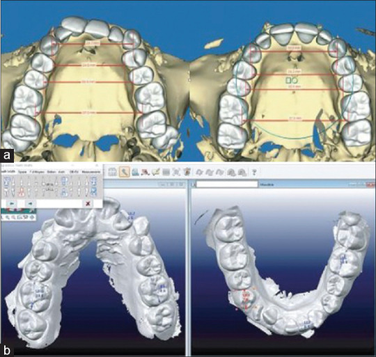
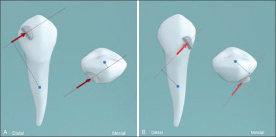
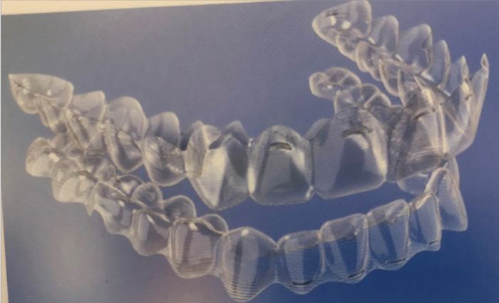
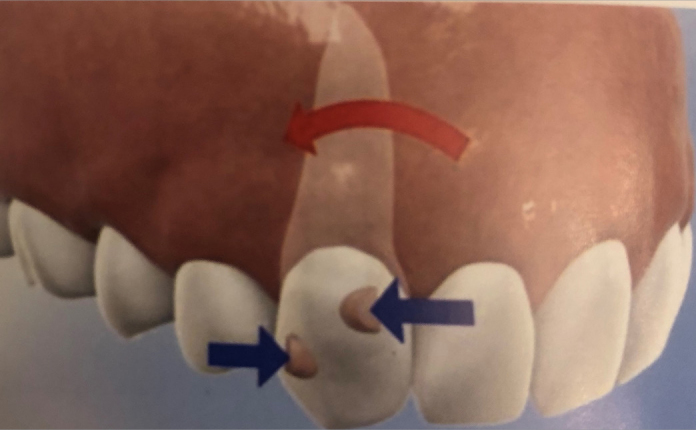
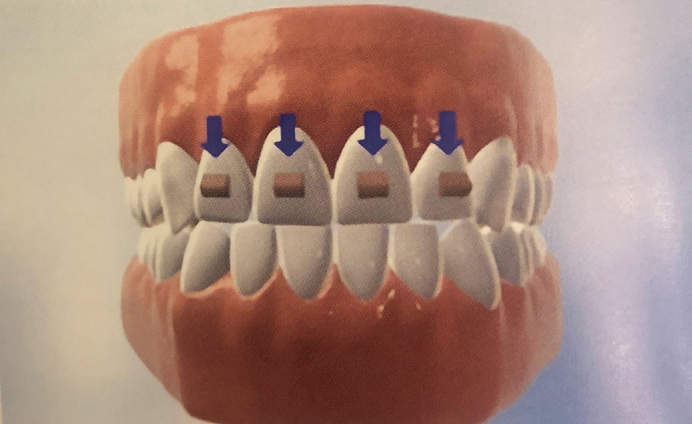
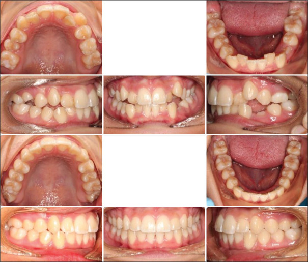
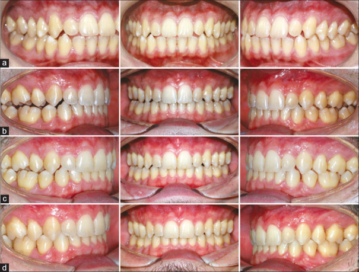

# アライナー矯正（クリアアライナー）の基礎

> このファイルはアライナー矯正の初学者向けに、専門用語を入れつつ解説を添えて書かれています。
> 主にアメリカ発の論文・エビデンスに基づいています。

---

## はじめに：アライナー矯正って何？

**クリアアライナー（clear aligner）** とは、透明なプラスチックでできた取り外し可能な矯正装置です。
歯にかぶせるマウスピースのようなもので、少しずつ形が違うものを順番に交換していくことで歯を動かします。

- **1999年**：Align Technology（アライン・テクノロジー）社が **Invisalign（インビザライン）** を発売
- **2000年**：FDA（アメリカ食品医薬品局）がインビザラインを承認
- **現在**：世界中で400万人以上が治療を受けている

---

## 参照した主な論文（すべてオープンアクセス）

| # | 論文タイトル | 著者 | 年 | PMC |
|---|---|---|---|---|
| 1 | Clear Aligner Therapy: Up to date review | AlMogbel AM | 2023 | [PMC10597356](https://pmc.ncbi.nlm.nih.gov/articles/PMC10597356/) |
| 2 | Orthodontic Treatment with Clear Aligners and The Scientific Reality Behind Their Marketing | Tamer I, Öztaş E, Marşan G | 2019 | [PMC7018497](https://pmc.ncbi.nlm.nih.gov/articles/PMC7018497/) |
| 3 | Efficacy of clear aligners in controlling orthodontic tooth movement: A systematic review | Rossini G, et al. | 2015 | [PMC8610387](https://pmc.ncbi.nlm.nih.gov/articles/PMC8610387/) |

---

## 1. アライナーの作り方（製造方法）

アライナーの製造方法は大きく分けて **2種類** あります。

### A. 手作業セットアップ（Manual Setup）

1. 歯型を取る（ポリビニルシロキサン＝型取りの材料）
2. 石膏模型（せっこうもけい）を作る
3. 動かしたい歯をノコギリで切り離して、目標の位置に移動
4. ワックスで固定
5. その模型にプラスチックシートを被せて真空成形（しんくうせいけい）

**アライナーの厚さ**：
- 0.020インチ → 0.025インチ → 0.030インチ と段階的に厚くする
- 厚くなるほど力が強くなる

### B. CAD-CAM（キャドキャム）テクノロジー

> CAD-CAM = Computer-Aided Design / Computer-Aided Manufacturing
> （コンピュータ支援設計 / コンピュータ支援製造）

1. 口の中を **デジタルスキャン**（3Dスキャナーで歯型を撮影）
2. コンピュータ上で **バーチャル治療計画** を作成
3. **ClinCheck（クリンチェック）** ソフトウェアで歯の動きをシミュレーション
4. **ステレオリソグラフィー**（3Dプリンティング技術）で製造

*出典: PMC10597356 - CBCT（コーンビームCT）と口腔内スキャンからのデジタル再構成 (CC BY-NC-SA 4.0)*

---

## 2. アライナーのバイオメカニクス（生体力学）

> バイオメカニクス（biomechanics）＝ 歯に力をかけて動かす仕組み

### 歯が動く原理

歯に力がかかると、歯の周りの組織（歯根膜＝しこんまく、PDL = Periodontal Ligament）が反応します：

- **圧迫側**（あっぱくがわ）：力がかかる方向の骨が **吸収**（きゅうしゅう＝溶ける）
- **牽引側**（けんいんがわ）：反対側の骨が **添加**（てんか＝新しく作られる）

この骨の **リモデリング（remodeling＝作り変え）** によって歯が動きます。

### アライナーの2つの動かし方

論文では、アライナーの歯の動かし方を **2つのシステム** に分けています：

| システム | 英語名 | どう動かす？ | 得意な動き |
|---|---|---|---|
| **変位駆動型** | Displacement Driven System | アライナーの形に合わせて歯が動く | 傾斜移動（ティッピング）、軽い回転 |
| **力駆動型** | Force Driven System | バイオメカニクスの原理で力を加える | 歯体移動（ボディリーム―ブメント）等の複雑な動き |

**ポイント：**
- 変位駆動型は単純な動きに向いている
- 力駆動型は **アタッチメント**（歯に付ける小さな突起）を使って複雑な動きを実現
- アライナーだけでは限界がある → **補助装置**（attachments、elastics等）が必要

### アタッチメント（Attachment）とは

*出典: PMC10597356 - 青：抵抗中心（center of resistance）、赤：作用線（line of action） (CC BY-NC-SA 4.0)*

アタッチメントとは、歯の表面に接着する **小さなコンポジットレジン（樹脂）の突起** です。

#### アタッチメントの種類

| 種類 | 英語名 | 目的 |
|---|---|---|
| **挺出アタッチメント** | Extrusion Attachment | 歯を引っ張り出す動き |
| **回転アタッチメント** | Rotation Attachment | 歯を回す動き |
| **歯根コントロールアタッチメント** | Root Control Attachment | 歯根の傾きを制御 |

*出典: PMC7018497 - パワーリッジ（Power Ridges）：歯根の軸方向の動きとトルクを制御する (Copyright 2019 Turkish Orthodontic Society)*

*出典: PMC7018497 - Root Control Attachment (Copyright 2019 Turkish Orthodontic Society)*

### パワーリッジ（Power Ridge）

アライナーの内面に付けた小さな突起で、**トルク（torque＝歯の回転力）** をコントロールします。
特に前歯の歯根の角度を制御するのに使います。

---

## 3. アライナーで可能な歯の動き

### 歯の移動の種類（基本用語）

| 動きの種類 | 英語名 | かんたんに言うと |
|---|---|---|
| **傾斜移動** | Tipping | 歯冠（しかん＝歯の頭）だけが傾く |
| **歯体移動** | Bodily Movement | 歯全体（冠＋根）が平行に動く |
| **回転** | Rotation | 歯がねじれるように回る |
| **挺出** | Extrusion | 歯を骨から引っ張り出す |
| **圧下** | Intrusion | 歯を骨の中に押し込む |
| **トルク** | Torque | 歯根の傾きを変える |

*出典: PMC7018497 - アライナーを使った前歯の挺出 (Copyright 2019 Turkish Orthodontic Society)*

---

## 4. アライナーの有効性（エビデンス）★超重要★

Rossini et al.（2015）のシステマティックレビュー（系統的レビュー＝複数の研究をまとめた信頼性の高い研究）より：

### 各歯の動きの正確性（Accuracy）

| 動きの種類 | 正確性 | 注意点 |
|---|---|---|
| **圧下（Intrusion）** | 33〜47% | 上顎中切歯45%、下顎中切歯47% |
| **挺出（Extrusion）** | 18〜30% | **最も苦手！** 上顎中切歯はわずか18% |
| **回転（Rotation）** | 29〜55% | 丸い形の歯（犬歯）は特に苦手。15°以上は19%まで低下 |
| **近遠心傾斜（Mesiodistal Tipping）** | 27〜49% | 下顎犬歯が最も苦手（27%） |
| **頬舌傾斜（Buccolingual Tipping）** | 38〜53% | 舌側傾斜（53%）＞唇側傾斜（38%） |
| **上顎臼歯の遠心移動（Molar Distalization）** | **88%** | 1.5mm以上の歯体移動で高い予測性 |
| **歯列の整列（Alignment）** | **78%改善** | 12%変化なし、10%悪化 |

### Kravitzの衝撃的な研究

> **「インビザラインで予測された歯の動きのうち、実際に達成されたのはわずか41%だった」**
> ― Kravitz et al.

これは非常に重要なデータです：
- 舌側への傾斜が最も正確：**47.1%**
- 挺出が最も不正確：**29.6%**
- 回転の達成率：**33%**
- 下顎犬歯が最も制御困難

### 治療時間の比較

| ケース | アライナー vs 固定式装置 |
|---|---|
| **非抜歯（ひばっし）ケース** | アライナーの方が **67%短い** |
| **抜歯ケース** | アライナーの方が **44%長い** |

### アライナーの成功率

- 軽度〜中等度の歯の動き：**80〜90%** の成功率
- 通院間隔：アライナーは10〜12週ごと（固定式は4〜6週ごと）
- チェアタイム（治療時間）はアライナーの方が短い

---

## 5. アライナーの適応症と禁忌症

### 適応症（こういう場合に使える）

| 適応症 | 英語名 | 説明 |
|---|---|---|
| 軽度の叢生 | Mild crowding | 1〜5mmの歯のガタガタ |
| 空隙（すきっ歯） | Spacing / Diastema | 歯と歯の間の隙間 |
| 後方拡大 | Posterior expansion | 奥歯のアーチを広げる |
| 1〜2歯の圧下 | Intrusion | 飛び出た歯を押し込む |
| 臼歯の遠心移動 | Molar distalization | 奥歯を後ろに動かす |
| 軽度の深い噛み合わせ | Mild deep bite | 前歯の噛み合わせが深い |

### 禁忌症（こういう場合は使えない・難しい）

| 禁忌症 | 英語名 | 理由 |
|---|---|---|
| 重度の叢生 | Severe crowding | 複数の抜歯が必要 |
| 複雑な咬合の問題 | Complex bite problems | アライナーの力では不十分 |
| 骨格的な問題 | Skeletal discrepancies | 骨のズレはアライナーでは治せない |
| 重度の回転 | Severe rotations | 正確性が低い |
| 活動性の歯周病 | Active periodontal disease | 歯を支える骨が弱い |
| 挺出が必要なケース | Extrusion cases | 最も苦手な動き |

---

## 6. アライナー治療の注意点

### 装着時間
- **1日22〜23時間** の装着が必要（食事と歯磨きの時以外はずっと）
- 装着しないと → 治療が長引く or 失敗する
- **コンプライアンス（compliance＝患者さんの協力）** が最も重要

### 歯根吸収（しこんきゅうしゅう）
- アライナーでも歯根吸収（Root Resorption＝歯の根っこが短くなること）は起きる
- ただし固定式装置より **軽度**
- Gay et al.の研究：**41.81%** の歯に歯根吸収の兆候

### 歯周組織への影響
- アライナーは取り外せるので **口腔衛生（こうくうえいせい）が保ちやすい**
- 固定式装置より **ホワイトスポットレジョン**（WSL＝初期むし歯の白い斑点）が少ない
- 歯周病のリスクも低い

### 治療後の安定性（Stability）
- 治療後の **リテンション**（retention＝保定）が重要
- 3年後の調査：アライナー群は固定式装置群より **後戻り** が多い
- **リテーナー**（retainer＝保定装置）の装着が必須

---

## 7. 治療前後の比較

*出典: PMC10597356 - 12歳女児の重度叢生。インビザラインで16ヶ月の治療 (CC BY-NC-SA 4.0)*

*出典: PMC10597356 - 連続的なアライナーの交換による空隙閉鎖 (CC BY-NC-SA 4.0)*

---

## 8. まとめ：アライナー矯正の重要ポイント

### 覚えるべき数字

| 項目 | 数値 |
|---|---|
| 装着時間 | 1日22〜23時間 |
| 全体の成功率（軽度〜中等度） | 80〜90% |
| 予測された動きの実際の達成率 | 約41%（Kravitz） |
| 挺出の正確性 | 18〜30%（最も苦手） |
| 臼歯遠心移動の予測性 | 88%（最も得意） |
| 非抜歯ケースの治療時間比較 | 固定式より67%短い |
| 抜歯ケースの治療時間比較 | 固定式より44%長い |

### 覚えるべき用語

| 用語 | 読み方 | 意味 |
|---|---|---|
| クリアアライナー | くりああらいなー | 透明な取り外し式矯正装置 |
| CAT | しーえーてぃー | Clear Aligner Therapy（アライナー治療） |
| ClinCheck | くりんちぇっく | インビザラインの治療計画ソフト |
| アタッチメント | あたっちめんと | 歯に付ける小さな樹脂の突起 |
| パワーリッジ | ぱわーりっじ | アライナー内面の突起（トルク制御用） |
| Smart Force | すまーとふぉーす | 最適な力を生む特殊なアタッチメント |
| IPR | あいぴーあーる | Interproximal Reduction（歯間のエナメルを削ること） |
| TADs | たっず | Temporary Anchorage Devices（歯科矯正用ミニスクリュー） |
| ステージング | すてーじんぐ | 各アライナーでの歯の移動量の設定 |
| コンプライアンス | こんぷらいあんす | 患者さんが指示通りに装着すること |
| リテンション | りてんしょん | 治療後の保定（歯が戻らないようにすること） |
| リモデリング | りもでりんぐ | 骨の作り変え（吸収と添加） |
| CAD-CAM | きゃどきゃむ | コンピュータ支援設計・製造 |
| WSL | だぶりゅーえすえる | White Spot Lesion（初期むし歯の白い斑点） |
| 歯根吸収 | しこんきゅうしゅう | 歯の根っこが短くなること |

---

## 参考文献

1. [AlMogbel AM. Clear Aligner Therapy: Up to date review article. J Orthod Sci. 2023;12:37. PMC10597356](https://pmc.ncbi.nlm.nih.gov/articles/PMC10597356/)
2. [Tamer I, Öztaş E, Marşan G. Orthodontic Treatment with Clear Aligners and The Scientific Reality Behind Their Marketing. Turk J Orthod. 2019;32(4):241-246. PMC7018497](https://pmc.ncbi.nlm.nih.gov/articles/PMC7018497/)
3. [Rossini G, et al. Efficacy of clear aligners in controlling orthodontic tooth movement: A systematic review. Angle Orthod. 2015;85(5):881-889. PMC8610387](https://pmc.ncbi.nlm.nih.gov/articles/PMC8610387/)
